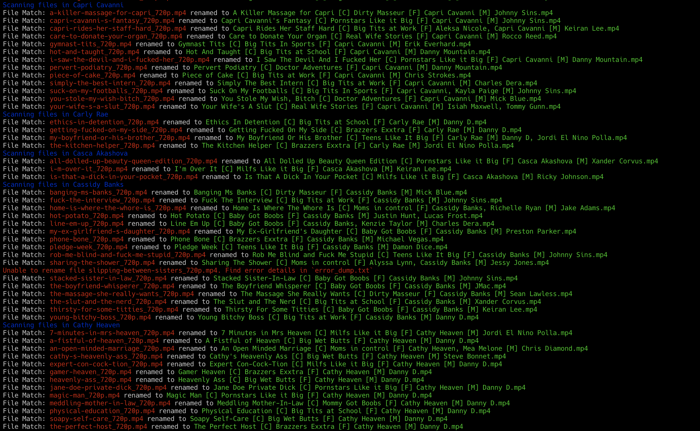

# XxxRename


[](https://codeclimate.com/github/c477y/xxx_rename/maintainability) [](https://codeclimate.com/github/c477y/xxx_rename/test_coverage)

A gem to rename your porn videos and integrate with your Stash app as a third-
party scraper.

Currently supports the following websites:

* [AdultTime](https://www.adulttime.com/)*
* [Babes](https://www.babes.com)
* [Blacked](https://www.blacked.com/)
* [BlackedRaw](https://www.blacked-raw.com/)
* [Brazzers](https://www.brazzers.com)
* [Casting Couch](https://castingcouch-x.com)
* [Dark X](https://www.darkx.com/en)
* [Digital Playground](https://www.digitalplayground.com)
* [Elegant Angel](https://www.elegantangel.com/)
* [Erotica X](https://www.eroticax.com/en)
* [Evil Angel](https://evilangel.com/)
* [Exotic4k](https://exotic4k.com)
* [FantasyHD](https://fantasyhd.com)
* [GoodPorn](https://goodporn.to/)
* [Hard X](https://www.hardx.com/en)
* [Holed](https://holed.com)
* [Jules Jordan](https://www.julesjordan.com/)
* [Lubed](https://lubed.com)
* [Manuel Ferrara](https://manuelferrara.com/)
* [Mofos](https://www.mofos.com)
* [My Very First Time](https://myveryfirsttime.com)
* [NF Busty](https://nfbusty.com/)
* [Nanny Spy](https://nannyspy.com)
* [POVd](https://povd.com)
* [PassionHD](https://passion-hd.com)
* [Puremature](https://puremature.com)
* [Reality Kings](https://www.realitykings.com/)
* [Slayed](https://www.slayed.com/)
* [SpyFam](https://spyfam.com)
* [Stash DB](https://stashdb.org/)
* [Tiny 4k](https://tiny4k.com)
* [Tushy Raw](https://www.tushyraw.com/)
* [Tushy](https://www.tushy.com/)
* [Twistys](https://www.twistys.com)
* [Vixen](https://www.vixen.com/)
* [X Empire](https://www.xempire.com/en)
* [Wicked](https://www.wicked.com/)
* [Zero Tolerance Films](https://www.zerotolerancefilms.com/en/?s=1)



## Installation

```shell
gem install xxx_rename
```

### Usage

#### Basic Usage

```shell
$ xxx_rename help

Commands:
  xxx_rename generate FILE|FOLDER        # Rename a file or all file(s) inside a given directory
  xxx_rename help [COMMAND]              # Describe available commands or one specific command
  xxx_rename migrate --version=VERSION   # Apply a rename migration file
  xxx_rename rollback --version=VERSION  # Rollback a migration
  xxx_rename version                     # Print the CLI version
```

#### Generate

Generate command scans all files and stores their scraped data inside a file
stored in the `xxx_rename` config directory. You can add actions that will
be performed with each successful match:

1. sync_to_stash : Sync the matched details to your Stash App. This will create
   a movie as well on Stash if the scene belongs to a movie (which is something
   that Stash does not do at the moment.)
2. log_rename_op : Create a migration file that logs a file with its new
   filename. Migrations are reversible operations that rename all files that
   are matched by xxx_rename.

```shell
$ xxx_rename help generate

Usage:
  xxx_rename generate FILE|FOLDER

Options:
  [--config=CONFIG]                                             # path to config file
  [--verbose], [--no-verbose]                                  # enable verbose logging
  [--override-site=OVERRIDE_SITE]                              # force use an override site
                                                               # Possible values: adult_time, babes, blacked, blacked_raw, brazzers, digital_playground, elegant_angel, evil_angel, goodporn, jules_jordan, manuel_ferrara, mofos, naughty_america, nf_busty, reality_kings, stash, tushy, tushy_raw, twistys, vixen, whale_media, wicked, x_empire, zero_tolerance
  [--nested], [--no-nested]                                    # recursively search for all files in the given directory
  [--force-refresh-datastore], [--no-force-refresh-datastore]  # force site client to fetch all scenes, if implemented
  [--actions=ACTIONS]                                          # action to perform on a successful match
                                                               # Possible values: sync_to_stash, log_rename_op
  [--force-refresh], [--no-force-refresh]                      # force match scenes from original sites
  [--checkpoint=CHECKPOINT]                                    # skip all iterations until check-pointed file is matched

Description:
  Scan files and generate metadata
  For first time users, run the command without any flags to generate a config file in $HOME/.config/xxx_rename

  $ xxx_rename generate

  The cli will look for a config file in these three places in order:
  * --config (This takes precedence over everything)
  * $HOME/.config/xxx_rename
  * HOME/xxx_rename

  Examples
  # Scan all files in a given directory and its sub-directories
  $ xxx_rename generate . --nested

  # Force the cli to use `brazzers` to match a file
  $ xxx_rename generate . --verbose --override_site=brazzers

  # Generate a migrations file to rename the matched files
  $ xxx_rename generate . --actions=log_rename_op
```

#### Migrate

```bash
$ xxx_rename help migrate

Usage:
  xxx_rename migrate --version=VERSION

Options:
  [--config=CONFIG]    # path to config file
  [--version=VERSION]  # Name of migration file to apply
                       # Default: latest

Description:
  WARNING: This is a destructive operation as it will rename files Run this on a small subset to be sure and run it at your own risk

  Rename files based on operations listed in a migration file.

  All rename files are located in your `generated_files_dir` directory. Migration files are plain YAML files of format 'output_YYYYMMDDHHMM.yml'

  Pass a migration file using option `--version YYYYMMDDHHMM`.
  If you want to apply a migration file that you have just created, pass the --version as "latest". Or don't pass the --version flag and the CLI will use the latest version by default.

  Migration files have the following format:

  -
    --- # 0 means the migration is not applied
    # 1 means the migration is applied
    # This flag prevents applying a migration that has already been applied
    ___MIGRATION_STATUS___: 0
    # All operations are stored as an array
    ___RENAME_ACTIONS___:
    # DO NOT MANIPULATE AN ARRAY ITEM! Doing so can result in unexpected
    # behaviour. You can remove an operation from the list entirely, but
    # the recommended way is to discard this migration completely,
    # modify the `output_format` for your file in the config and run the
    # generate command again
    - !ruby/object:XxxRename::Data::FileRenameOp
    attributes:
      :key: eab204175567d39202c1df5895e443be # DO NOT MODIFY THIS
      :directory: "/ABSOLUTE/DIRECTORY/TOFILE"
      :source_filename: ORIGINAL_FILENAME.MP4
      :output_filename: NEW_FILENAME.MP4
      :mtime: 2000-01-01 00:00:00.000000000 +00:00

  Example Usage:

  $ xxx_rename migrate --version=202301131252

  $ xxx_rename migrate
```

#### Rollback

```bash
$ xxx_rename help rollback

Usage:
  xxx_rename rollback --version=VERSION

Options:
  [--config=CONFIG]    # path to config file
  [--version=VERSION]  # Name of migration file to apply
                       # Default: latest

Description:
  Reverse the actions taken by the `migrate` command

  Read the help command for more information

  $ xxx_rename help migrate
```

## FAQs

### How does this work?

xxx_rename works assumes all files are a scene. Each scene can be matched by one
(or more) site client (a site that will be scraped to fetch details). For some
files that are downloaded from original sources (at this time these are mg
premium sites brazzers along with evil angel, goodporn, NF busty and vixen
media), xxx_rename will try to guess the site client based on the unique format
of the filename themselves.

In other case, you are required to define these rules yourself in the config
file. Rules are just string of tokens that generate a regex to match a file. For
example, let's say you have a file like this "[EvilAngel] Blake Blossom - Facial
Fantasy 3.mp4". You can create a rule in your config file like this:

```yml
evil_angel:
  file_source_format:
     # Notice the missing .ext in the pattern
     - "[EvilAngel] %female_actors - %title"
```

Now, when you run the `generate` command, xxx_rename will look at the rules and
match the file with evil_angel. It will then use the %title(Facial Fantasy 3)
and %female_actors([Blake Blossom]) data and search EvilAngel for a scene that
matches the parsed details from a file. This will *near guarantee* that the
match will be correct (which can be an issue with other tools like
[stash-box](https://stashdb.org/) or
[metadataapi.net](https://metadataapi.net/)).

### What are `collection_tags` in the config?

Think of `collection_tag` as reserved keywords. `collection_tags` are three
character unique keywords that are used to associate a file with a site client.
The CLI expects all filenames to have a unique format, which can be a problem
when all files are renamed using a common format. `collection_tags` introduce
just enough uniqueness in the filename to allow `xxx_rename` associate them with
a site client.

### What are the supported tokens

| Token             | Regex                                                         | Description                                                        |
| ----------------- | ------------------------------------------------------------- | ------------------------------------------------------------------ |
| %title            | (?&lt;title>[\\w\\s\\-_,'\"\\.]+)                             | Title of the scene                                                 |
| %collection       | (?&lt;collection>[\\w\\s\\-_,'\"\\.]+)                        | Usually the studio                                                 |
| %collection_op    | (?&lt;collection>[\\w\\s\\-_,'\"]*?)                          | Same as collection, but allows optional values                     |
| %collection_tag_1 | (?&lt;collection_tag>\\w)                                     | A single character reserved word                                   |
| %collection_tag_2 | (?&lt;collection_tag>\\w{,2})                                 | Two character reserved word                                        |
| %collection_tag_3 | (?&lt;collection_tag>\\w{,3})                                 | Three character reserved word                                      |
| %female_actors    | (?&lt;female_actors>[\\w\\s\\-_,'\"\\.]+)                     | Comma Separated list of names                                      |
| %male_actors      | (?&lt;male_actors>[\\w\\s\\-_,'\"\\.]+)                       | Comma Separated list of names                                      |
| %male_actors_op   | (?&lt;male_actors>[\\w\\s\\-_,'\"]*)?                         | Same as %male_actors, but optional                                 |
| %actors           | (?&lt;actors>[\\w\\s\\-_,'\"\\.]+)                            | Use if there's no obvious separator between male and female actors |
| %id               | (?&lt;id>(\\d+\|[a-z\\-\\_]+))                                | Unique ID                                                          |
| %id_op            | (?&lt;id>(\\d*\|[a-z\\-\\_]*))?                               | Same as ID, but optional                                           |
| %ignore_1_word    | (\\w\\s){1}                                                   | Ignore a filler word                                               |
| %ignore_2_words   | (\\w\\s){2}                                                   | Ignore 2 filler word                                               |
| %ignore_3_words   | (\\w\\s){3}                                                   | Ignore 3 filler words                                              |
| %ignore_4_words   | (\\w\\s){4}                                                   | Ignore 4 filler words                                              |
| %ignore_5_words   | (\\w\\s){5}                                                   | Ignore 5 filler words                                              |
| %ignore_6_words   | (\\w\\s){6}                                                   | Ignore 6 filler words                                              |
| %ignore_7_words   | (\\w\\s){7}                                                   | Ignore 7 filler words                                              |
| %ignore_all       | ".*                                                           | Ignore everything                                                  |
| %yyyy_mm_dd       | (?&lt;year>\\d{4})\_(?&lt;month>\\d{1,2})_(?&lt;day>\\d{1,2}) | Complete year in YYYY_MM_DD for                                    |
| %dd               | (?&lt;day>\\d{1,2})                                           | DD (Day of Month)                                                  |
| %mm               | (?&lt;month>\\d{1,2})                                         | MM (Month of Year)                                                 |
| %yyyy             | (?&lt;year>\\d{4})                                            | YYYY (Year)                                                        |
| %yy               | (?&lt;year>\\d{2,4})                                          | YY (Compressed Year)                                               |

### How does xxx_rename compare with Stash DB?

xxx_rename can be considered an extension to
[Stash](https://github.com/stashapp/stash). It does not intend to compete with
the sheer number of features provided by Stash. In fact, stash-box is considered
a valid `site client` if you want to use it. Stash DB's matches are pretty
accurate given their community contribution and phash matching algorithm.
But I also realise stash is an overkill for a lot of people. For someone who
has a casual collection and just want to organize their files with meaningful
names (compared with obfuscated names some sites use for their original files),
xxx_rename works beautifully and serves their purpose well.

You choose how you want your files to be renamed and what data you like and what
you don't. Change your mind in the future? No problem, xxx_rename remembers all
scenes and you can choose a new format anytime you want.

### How does xxx_rename compare with namer?

[namer](https://github.com/ThePornDatabase/namer) works on a similar principle
as xxx_rename, in which it also uses regexes to fetch metadata from a filename.
But it matches a search using its own database
[metadataapi.net](https://metadataapi.net). While the tool is really amazing and
requires little configuration from the user, it results in mismatches and you
can end up with a filename that is simply incorrect.

xxx_rename works on the principle of BYOD (Bring Your Own Data). All search
happens locally, there are no external servers, no tracking whatsoever and you
own your database. Since there's a certain configuration required from your
side, there are little chances for any errors. xxx_rename is not a swiss knife
of all scrapers, it prefers correctness over convenience.

### Why is Site X not supported?

Some websites are really stubborn as they do not provide a basic search
facility. The biggest example of this is Naughty America, which has been a paid
to find a workaround and implement from scratch. Some websites lock their search
behind a paywall(membership), so while it's possible for me to implement a
search functionality, it is impossible to test and maintain once the membership
period is over.

### What sites can be supported?

Any site that provide a meaningful filename and have a usable API/website. Raise
a request on the [issues](https://github.com/c477y/xxx_rename/issues) page with
the name of the website you want to get support for and a list of original
filenames (not the actual files). I can't promise if I will be able to implement
it but the request will be open for someone in the community to integrate.

## Contribution

Pull requests are welcome! See [Development](docs/DEVELOPMENT.md) for setup
instructions.
