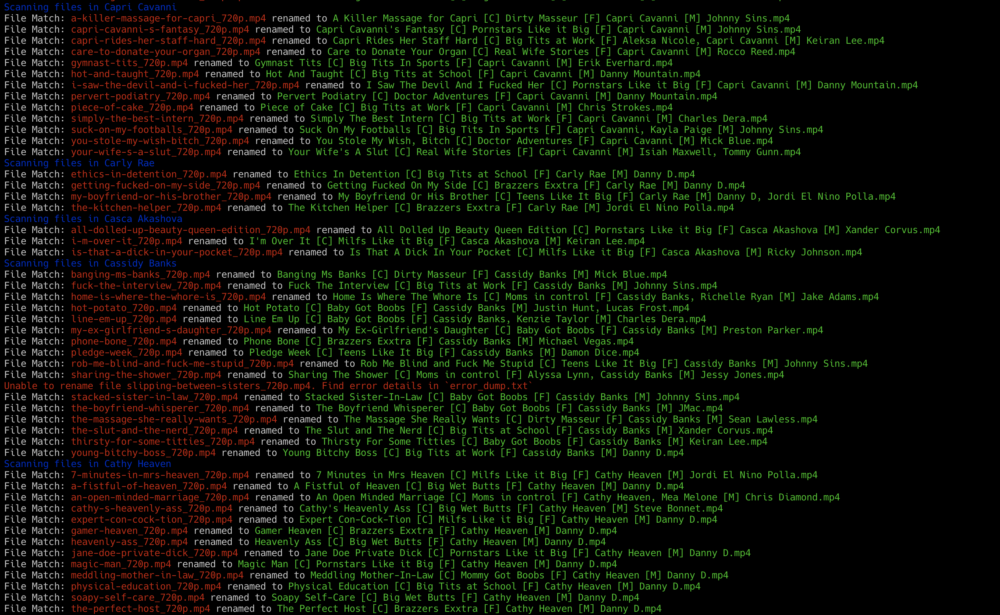

# XxxRename

A gem to rename files downloaded from premium porn sites. Currently supports Brazzers and Digital Playground.

## Installation

```shell
gem install xxx_rename
```

### Pre-requisites

The videos should be downloaded from the original site since this tool uses the scene name to search and rename.

### Usage

```shell
xxx_rename --help

Commands:
  xxx_rename help [COMMAND]              # Describe available commands or one specific command
  xxx_rename rename object --site=SITE   # Rename a file or files inside a folder
  xxx_rename rename_via_actor directory  # Attempts to generate scene name with actor name
  xxx_rename rollback file               # Rollback changes created by the rename tool
```



## FAQs

### Why?

While downloading videos from porn sites, they always end up giving unhelpful names which don't make any sense. eg. `slip-and-slide_1080p.mp4`. Not only is this useless, it makes organising the files a living hell if the number of files are too large. Solution: You can keep track of the downloads and create folders on the fly. Bheh!!! Ain't no one got time for that.

With this gem, you can download all the videos in any folder you want and this command will scan through the folder looking for the video files and rename them in the format `<scene name> [C] <collection name> [F] <female actor(s)> [M] <male actore(s)>.mp4`. In case the generated names becomes too long, the collection and male actors are truncated. This format may not be most suitable for everyone but it atleast gives each file a unique and meaningful name.

### How does this work?

Thanks to the amazing APIs exposed by Brazzers and Digital Playground, this service reads the scene name from the file and searches for the *exact* match using the API. The only case where this can fail is if the API fails or limits the response (e.g. a pornstar is removed from their site *or* a very specific type of error called "Banned Search Word"). The gem will only rename the file if the names are an exact match. That said, it can fail if there are two scenes with the exact same name and there's no fix for this issue.

### I am not sure of the changes. Can I review them first?

Yes! The `rename` command will only rename files if you pass the `--save` flag. Without the flag it just outputs what the file will be renamed to. So say you want to give your own naming format, you can fork this project, change the scheme and review what the generated names will be.

### I am not happy with the generated filenames. Can I revert?

Yes again! The `rename` command emits a `response.csv` file in the folder from where it was invoked. Use the `rollback` command to revert back the changes and you will get your files in the original condition.

If you really want to test out this tool, give it a single file instead of an entire directory and review it yourself.

### Why is Site X not supported?

The tool works on two assumptions:

1. The porn site exposes a usable `/search` endpoint. I am not doing any web-scraping.
2. The videos should be downloaded from the original site. I don't support piracy and this constraint ensures that this tool knows what to expect in its input.

That said, sites like [bang](https://www.bang.com/), [archangelvideo](archangelvideo.com/), [julesjordan](https://julesjordan.com/) and [naughtyamerica](https://www.naughtyamerica.com) are not supported since they don't have a search API and it's not possible to search for a scene using the scene name.

### What sites can be supported?

Any site owned by the parent company of Brazzers will be the most easy to implement since the base URL is the same e.g. Babes, Reality Kings, etc. It should be easy to implement the same for Vixen, Blacked, Blacked Raw, Tushy, Tushy Raw, and Deeper and any contributions are welcome.
